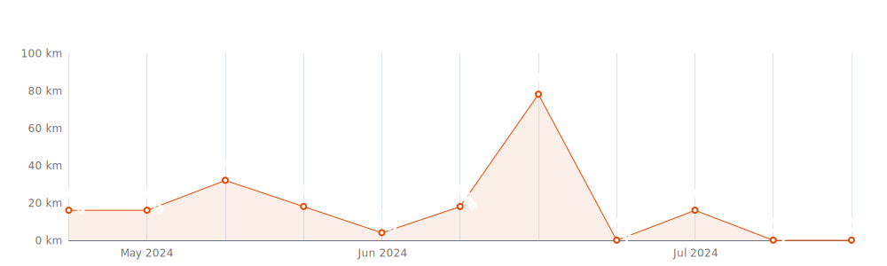
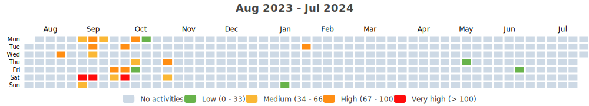

    

Since I began cycling `12 years and 3 months` ago on `01-01-2013`,
I had `255 cycling days`. 
I recorded a total distance of `6 982 km`
(`0.17` trips around the world 🌍 and
`0.018` trips to the moon 🌕),
an elevation of `44 467 m`
(`5.0` times Mount Everest 🏔)
and a total time of `1w 3d 14h 58m` 🎉

That's a daily average of `2 km`,
a weekly average of `12 km` and a
monthly average of `51 km` 🐣

I burned `159570 calories` doing so, that's about `591` pizza slices 🍕

---

<kbd><a href="#weekly-distances">Weekly distances</a></kbd> |
<kbd><a href="#activities">Activities</a></kbd> |
<kbd><a href="#monthly-stats">Monthly stats</a></kbd> |
<kbd><a href="#activity-intensity">Activity intensity</a></kbd> |
<kbd><a href="#stats-per-weekday">Stats per weekday</a></kbd> |
<kbd><a href="#daytime-stats">Daytime stats</a></kbd> |
<kbd><a href="#stats-per-bike">Stats per bike</a></kbd> |
<kbd><a href="#best-power-outputs-over-time">Power outputs</a></kbd> |
<kbd><a href="#eddington-chart">Eddington</a></kbd> |
<kbd><a href="#yearly-distances">Yearly distances</a></kbd> |
<kbd><a href="#distance-breakdown">Distance breakdown</a></kbd> |
<kbd><a href="#challenge-consistency">Challenge consistency</a></kbd> |

## Weekly distances

## Activities

<table>
    <tr>
        <th></th>
        <th></th>
        <th align="center"></th>
        <th align="center"></th>
        <th align="center"></th>
        <th align="center"></th>
        <th align="center"></th>
        <th align="center"></th>
    </tr>
            <tr>
            <td>29-04-24</td>
            <td>
                
<a href="https://www.strava.com/activities/11293931158" title="Kcal: 402 | Gear: GT ">30 min Feel Good Ride with...</a>
            </td>
            <td align="center">16 km</td>
            <td align="center">0 m</td>
            <td align="center">30:00</td>
            <td align="center">164 w</td>
            <td align="center">31.2 km/h</td>
            <td align="center">n/a</td>
        </tr>
            <tr>
            <td>28-04-24</td>
            <td>
                
<a href="https://www.strava.com/activities/11286933006" title="Kcal: 21 | Gear: GT ">5 min Cool Down Ride with ...</a>
            </td>
            <td align="center">2 km</td>
            <td align="center">0 m</td>
            <td align="center">5:00</td>
            <td align="center">53 w</td>
            <td align="center">19.6 km/h</td>
            <td align="center">n/a</td>
        </tr>
            <tr>
            <td>28-04-24</td>
            <td>
                
<a href="https://www.strava.com/activities/11286896165" title="Kcal: 423 | Gear: GT ">30 min Monschau Eifel Ride</a>
            </td>
            <td align="center">16 km</td>
            <td align="center">0 m</td>
            <td align="center">30:00</td>
            <td align="center">173 w</td>
            <td align="center">32.4 km/h</td>
            <td align="center">n/a</td>
        </tr>
            <tr>
            <td>26-04-24</td>
            <td>
                
<a href="https://www.strava.com/activities/11270774088" title="Kcal: 409 | Gear: GT ">30 min Power Zone Enduranc...</a>
            </td>
            <td align="center">16 km</td>
            <td align="center">0 m</td>
            <td align="center">30:01</td>
            <td align="center">167 w</td>
            <td align="center">31.8 km/h</td>
            <td align="center">n/a</td>
        </tr>
            <tr>
            <td>18-04-24</td>
            <td>
                
<a href="https://www.strava.com/activities/11212586658" title="Kcal: 243 | Gear: GT ">20 min Osnabrück Ride</a>
            </td>
            <td align="center">10 km</td>
            <td align="center">0 m</td>
            <td align="center">20:00</td>
            <td align="center">149 w</td>
            <td align="center">30.6 km/h</td>
            <td align="center">n/a</td>
        </tr>
        </table>

    
Older activities

    <table>
        <tr>
            <th></th>
            <th></th>
            <th align="center"></th>
            <th align="center"></th>
            <th align="center"></th>
            <th align="center"></th>
            <th align="center"></th>
            <th align="center"></th>
        </tr>
                    <tr>
                <td>16-04-24</td>
                <td>
                    
<a href="https://www.strava.com/activities/11197967618" title="Kcal: 28 | Gear: GT ">5 min Cool Down Ride with ...</a>
                </td>
                <td align="center">2 km</td>
                <td align="center">0 m</td>
                <td align="center">5:00</td>
                <td align="center">70 w</td>
                <td align="center">22.1 km/h</td>
                <td align="center">n/a</td>
            </tr>
                    <tr>
                <td>16-04-24</td>
                <td>
                    
<a href="https://www.strava.com/activities/11197922443" title="Kcal: 447 | Gear: GT ">30 min EDM Ride with Olivi...</a>
                </td>
                <td align="center">16 km</td>
                <td align="center">0 m</td>
                <td align="center">30:00</td>
                <td align="center">183 w</td>
                <td align="center">32.3 km/h</td>
                <td align="center">n/a</td>
            </tr>
                    <tr>
                <td>07-04-24</td>
                <td>
                    
<a href="https://www.strava.com/activities/11130634006" title="Kcal: 312 | Gear: GT ">30 min Low Impact Ride wit...</a>
                </td>
                <td align="center">14 km</td>
                <td align="center">0 m</td>
                <td align="center">30:00</td>
                <td align="center">127 w</td>
                <td align="center">28.4 km/h</td>
                <td align="center">n/a</td>
            </tr>
                    <tr>
                <td>06-04-24</td>
                <td>
                    
<a href="https://www.strava.com/activities/11122114356" title="Kcal: 91 | Gear: GT ">10 min P!nk Cool Down Ride...</a>
                </td>
                <td align="center">5 km</td>
                <td align="center">0 m</td>
                <td align="center">10:00</td>
                <td align="center">112 w</td>
                <td align="center">27.2 km/h</td>
                <td align="center">n/a</td>
            </tr>
                    <tr>
                <td>06-04-24</td>
                <td>
                    
<a href="https://www.strava.com/activities/11122059607" title="Kcal: 76 | Gear: GT ">Extra 10: Listening Party ...</a>
                </td>
                <td align="center">4 km</td>
                <td align="center">0 m</td>
                <td align="center">10:00</td>
                <td align="center">93 w</td>
                <td align="center">25.1 km/h</td>
                <td align="center">n/a</td>
            </tr>
                    <tr>
                <td>06-04-24</td>
                <td>
                    
<a href="https://www.strava.com/activities/11122005558" title="Kcal: 376 | Gear: GT ">30 min London Ride with Ha...</a>
                </td>
                <td align="center">15 km</td>
                <td align="center">0 m</td>
                <td align="center">30:00</td>
                <td align="center">153 w</td>
                <td align="center">30.2 km/h</td>
                <td align="center">n/a</td>
            </tr>
                    <tr>
                <td>13-03-24</td>
                <td>
                    
<a href="https://www.strava.com/activities/10954030228" title="Kcal: n/a | Gear: GT ">45 min Power Zone Enduranc...</a>
                </td>
                <td align="center">0 km</td>
                <td align="center">0 m</td>
                <td align="center">45:00</td>
                <td align="center">n/a</td>
                <td align="center">0 km/h</td>
                <td align="center">n/a</td>
            </tr>
                    <tr>
                <td>13-03-24</td>
                <td>
                    
<a href="https://www.strava.com/activities/10953980229" title="Kcal: 416 | Gear: GT ">30 min Classic Rock Ride w...</a>
                </td>
                <td align="center">16 km</td>
                <td align="center">0 m</td>
                <td align="center">30:00</td>
                <td align="center">170 w</td>
                <td align="center">32 km/h</td>
                <td align="center">n/a</td>
            </tr>
                    <tr>
                <td>04-03-24</td>
                <td>
                    
<a href="https://www.strava.com/activities/10891261164" title="Kcal: 15 | Gear: GT ">5 min Post-Ride Stretch wi...</a>
                </td>
                <td align="center">0 km</td>
                <td align="center">0 m</td>
                <td align="center">5:00</td>
                <td align="center">n/a</td>
                <td align="center">0 km/h</td>
                <td align="center">n/a</td>
            </tr>
                    <tr>
                <td>04-03-24</td>
                <td>
                    
<a href="https://www.strava.com/activities/10891218800" title="Kcal: 56 | Gear: GT ">5 min Cool Down Ride with ...</a>
                </td>
                <td align="center">2 km</td>
                <td align="center">0 m</td>
                <td align="center">5:00</td>
                <td align="center">139 w</td>
                <td align="center">29.6 km/h</td>
                <td align="center">n/a</td>
            </tr>
                    <tr>
                <td>04-03-24</td>
                <td>
                    
<a href="https://www.strava.com/activities/10891182181" title="Kcal: 444 | Gear: GT ">30 min Fatboy Slim Ride wi...</a>
                </td>
                <td align="center">16 km</td>
                <td align="center">0 m</td>
                <td align="center">30:00</td>
                <td align="center">181 w</td>
                <td align="center">32.6 km/h</td>
                <td align="center">n/a</td>
            </tr>
                    <tr>
                <td>04-03-24</td>
                <td>
                    
<a href="https://www.strava.com/activities/10891025121" title="Kcal: 58 | Gear: GT ">5 min Warm Up Ride with Er...</a>
                </td>
                <td align="center">2 km</td>
                <td align="center">0 m</td>
                <td align="center">5:00</td>
                <td align="center">143 w</td>
                <td align="center">29.5 km/h</td>
                <td align="center">n/a</td>
            </tr>
                    <tr>
                <td>25-02-24</td>
                <td>
                    
<a href="https://www.strava.com/activities/10835286078" title="Kcal: 617 | Gear: GT ">45 min Power Zone Enduranc...</a>
                </td>
                <td align="center">24 km</td>
                <td align="center">0 m</td>
                <td align="center">45:01</td>
                <td align="center">168 w</td>
                <td align="center">31.9 km/h</td>
                <td align="center">n/a</td>
            </tr>
                    <tr>
                <td>24-02-24</td>
                <td>
                    
<a href="https://www.strava.com/activities/10825150081" title="Kcal: 412 | Gear: GT ">30 min Power Zone Enduranc...</a>
                </td>
                <td align="center">16 km</td>
                <td align="center">0 m</td>
                <td align="center">30:00</td>
                <td align="center">169 w</td>
                <td align="center">31.7 km/h</td>
                <td align="center">n/a</td>
            </tr>
                    <tr>
                <td>06-02-24</td>
                <td>
                    
<a href="https://www.strava.com/activities/10710881777" title="Kcal: 63 | Gear: GT ">5 min Cool Down Ride with ...</a>
                </td>
                <td align="center">3 km</td>
                <td align="center">0 m</td>
                <td align="center">5:00</td>
                <td align="center">156 w</td>
                <td align="center">31.1 km/h</td>
                <td align="center">n/a</td>
            </tr>
                    <tr>
                <td>06-02-24</td>
                <td>
                    
<a href="https://www.strava.com/activities/10710816553" title="Kcal: 441 | Gear: GT ">30 min Power Zone Rock Rid...</a>
                </td>
                <td align="center">16 km</td>
                <td align="center">0 m</td>
                <td align="center">30:00</td>
                <td align="center">181 w</td>
                <td align="center">32.5 km/h</td>
                <td align="center">n/a</td>
            </tr>
                    <tr>
                <td>30-01-24</td>
                <td>
                    
<a href="https://www.strava.com/activities/10663602369" title="Kcal: 72 | Gear: GT ">5 min Cool Down Ride with ...</a>
                </td>
                <td align="center">3 km</td>
                <td align="center">0 m</td>
                <td align="center">5:01</td>
                <td align="center">162 w</td>
                <td align="center">31.3 km/h</td>
                <td align="center">150</td>
            </tr>
                    <tr>
                <td>30-01-24</td>
                <td>
                    
<a href="https://www.strava.com/activities/10663554695" title="Kcal: 668 | Gear: GT ">45 min Power Zone Enduranc...</a>
                </td>
                <td align="center">24 km</td>
                <td align="center">0 m</td>
                <td align="center">45:00</td>
                <td align="center">180 w</td>
                <td align="center">32.6 km/h</td>
                <td align="center">153</td>
            </tr>
                    <tr>
                <td>21-01-24</td>
                <td>
                    
<a href="https://www.strava.com/activities/10604202475" title="Kcal: 373 | Gear: GT ">30 min Power Zone Enduranc...</a>
                </td>
                <td align="center">16 km</td>
                <td align="center">0 m</td>
                <td align="center">30:00</td>
                <td align="center">176 w</td>
                <td align="center">32.1 km/h</td>
                <td align="center">34</td>
            </tr>
                    <tr>
                <td>12-01-24</td>
                <td>
                    
<a href="https://www.strava.com/activities/10546205677" title="Kcal: 124 | Gear: GT ">10 min 1989 (Taylor&#039;s Vers...</a>
                </td>
                <td align="center">5 km</td>
                <td align="center">0 m</td>
                <td align="center">10:01</td>
                <td align="center">152 w</td>
                <td align="center">30.8 km/h</td>
                <td align="center">n/a</td>
            </tr>
                    <tr>
                <td>12-01-24</td>
                <td>
                    
<a href="https://www.strava.com/activities/10546149675" title="Kcal: 474 | Gear: GT ">30 min Power Zone Ride wit...</a>
                </td>
                <td align="center">17 km</td>
                <td align="center">0 m</td>
                <td align="center">30:00</td>
                <td align="center">196 w</td>
                <td align="center">33.3 km/h</td>
                <td align="center">n/a</td>
            </tr>
                    <tr>
                <td>12-01-24</td>
                <td>
                    
<a href="https://www.strava.com/activities/10545917586" title="Kcal: 51 | Gear: GT ">5 min Warm Up Ride with Ch...</a>
                </td>
                <td align="center">2 km</td>
                <td align="center">0 m</td>
                <td align="center">5:00</td>
                <td align="center">126 w</td>
                <td align="center">28.4 km/h</td>
                <td align="center">n/a</td>
            </tr>
                    <tr>
                <td>10-01-24</td>
                <td>
                    
<a href="https://www.strava.com/activities/10534102458" title="Kcal: 59 | Gear: GT ">5 min Cool Down Ride with ...</a>
                </td>
                <td align="center">3 km</td>
                <td align="center">0 m</td>
                <td align="center">5:00</td>
                <td align="center">146 w</td>
                <td align="center">30.2 km/h</td>
                <td align="center">n/a</td>
            </tr>
                    <tr>
                <td>10-01-24</td>
                <td>
                    
<a href="https://www.strava.com/activities/10534061725" title="Kcal: 650 | Gear: GT ">45 min Power Zone Enduranc...</a>
                </td>
                <td align="center">24 km</td>
                <td align="center">0 m</td>
                <td align="center">45:01</td>
                <td align="center">179 w</td>
                <td align="center">32.4 km/h</td>
                <td align="center">n/a</td>
            </tr>
                    <tr>
                <td>09-01-24</td>
                <td>
                    
<a href="https://www.strava.com/activities/10527461145" title="Kcal: 65 | Gear: GT ">5 min Six: the Musical Coo...</a>
                </td>
                <td align="center">3 km</td>
                <td align="center">0 m</td>
                <td align="center">5:00</td>
                <td align="center">159 w</td>
                <td align="center">31.4 km/h</td>
                <td align="center">n/a</td>
            </tr>
                    <tr>
                <td>09-01-24</td>
                <td>
                    
<a href="https://www.strava.com/activities/10527427301" title="Kcal: 637 | Gear: GT ">45 min Power Zone Enduranc...</a>
                </td>
                <td align="center">24 km</td>
                <td align="center">0 m</td>
                <td align="center">45:00</td>
                <td align="center">175 w</td>
                <td align="center">32.1 km/h</td>
                <td align="center">n/a</td>
            </tr>
                    <tr>
                <td>07-01-24</td>
                <td>
                    
<a href="https://www.strava.com/activities/10514771962" title="Kcal: 55 | Gear: GT ">5 min Cool Down Ride with ...</a>
                </td>
                <td align="center">2 km</td>
                <td align="center">0 m</td>
                <td align="center">5:00</td>
                <td align="center">136 w</td>
                <td align="center">29.4 km/h</td>
                <td align="center">n/a</td>
            </tr>
                    <tr>
                <td>07-01-24</td>
                <td>
                    
<a href="https://www.strava.com/activities/10514744946" title="Kcal: 411 | Gear: GT ">30 min Power Zone Enduranc...</a>
                </td>
                <td align="center">16 km</td>
                <td align="center">0 m</td>
                <td align="center">30:00</td>
                <td align="center">169 w</td>
                <td align="center">31.7 km/h</td>
                <td align="center">n/a</td>
            </tr>
                    <tr>
                <td>04-01-24</td>
                <td>
                    
<a href="https://www.strava.com/activities/10495480092" title="Kcal: 43 | Gear: GT ">5 min Cool Down Ride with ...</a>
                </td>
                <td align="center">2 km</td>
                <td align="center">0 m</td>
                <td align="center">5:00</td>
                <td align="center">107 w</td>
                <td align="center">26.8 km/h</td>
                <td align="center">n/a</td>
            </tr>
                    <tr>
                <td>04-01-24</td>
                <td>
                    
<a href="https://www.strava.com/activities/10495442141" title="Kcal: 411 | Gear: GT ">30 min Power Zone Enduranc...</a>
                </td>
                <td align="center">16 km</td>
                <td align="center">0 m</td>
                <td align="center">30:00</td>
                <td align="center">169 w</td>
                <td align="center">31.7 km/h</td>
                <td align="center">n/a</td>
            </tr>
                    <tr>
                <td>03-01-24</td>
                <td>
                    
<a href="https://www.strava.com/activities/10489010568" title="Kcal: 718 | Gear: GT ">45 min Power Zone Enduranc...</a>
                </td>
                <td align="center">25 km</td>
                <td align="center">0 m</td>
                <td align="center">45:01</td>
                <td align="center">198 w</td>
                <td align="center">33.5 km/h</td>
                <td align="center">n/a</td>
            </tr>
                    <tr>
                <td>03-01-24</td>
                <td>
                    
<a href="https://www.strava.com/activities/10488555412" title="Kcal: 9 | Gear: GT ">45 min Power Zone Enduranc...</a>
                </td>
                <td align="center">0 km</td>
                <td align="center">0 m</td>
                <td align="center">1:01</td>
                <td align="center">113 w</td>
                <td align="center">27.2 km/h</td>
                <td align="center">n/a</td>
            </tr>
                    <tr>
                <td>01-01-24</td>
                <td>
                    
<a href="https://www.strava.com/activities/10476380836" title="Kcal: 100 | Gear: GT ">10 min Bruce Springsteen C...</a>
                </td>
                <td align="center">5 km</td>
                <td align="center">0 m</td>
                <td align="center">10:01</td>
                <td align="center">122 w</td>
                <td align="center">28.2 km/h</td>
                <td align="center">n/a</td>
            </tr>
                    <tr>
                <td>01-01-24</td>
                <td>
                    
<a href="https://www.strava.com/activities/10476330830" title="Kcal: 202 | Gear: GT ">20 min New Year&#039;s Day Reco...</a>
                </td>
                <td align="center">9 km</td>
                <td align="center">0 m</td>
                <td align="center">20:00</td>
                <td align="center">124 w</td>
                <td align="center">28.1 km/h</td>
                <td align="center">n/a</td>
            </tr>
                    <tr>
                <td>01-01-24</td>
                <td>
                    
<a href="https://www.strava.com/activities/10476238048" title="Kcal: 252 | Gear: GT ">20 min New Year&#039;s Day Ride...</a>
                </td>
                <td align="center">10 km</td>
                <td align="center">0 m</td>
                <td align="center">20:00</td>
                <td align="center">155 w</td>
                <td align="center">30.8 km/h</td>
                <td align="center">n/a</td>
            </tr>
                    <tr>
                <td>26-12-23</td>
                <td>
                    
<a href="https://www.strava.com/activities/10441589088" title="Kcal: 386 | Gear: GT ">30 min Disney Holiday Ride...</a>
                </td>
                <td align="center">15 km</td>
                <td align="center">0 m</td>
                <td align="center">37:30</td>
                <td align="center">154 w</td>
                <td align="center">24.7 km/h</td>
                <td align="center">n/a</td>
            </tr>
                    <tr>
                <td>23-12-23</td>
                <td>
                    
<a href="https://www.strava.com/activities/10426880830" title="Kcal: 387 | Gear: GT ">30 min Paramount Holiday R...</a>
                </td>
                <td align="center">16 km</td>
                <td align="center">0 m</td>
                <td align="center">30:00</td>
                <td align="center">158 w</td>
                <td align="center">31 km/h</td>
                <td align="center">n/a</td>
            </tr>
                    <tr>
                <td>28-11-23</td>
                <td>
                    
<a href="https://www.strava.com/activities/10297703555" title="Kcal: 423 | Gear: GT ">30 min Liverpool FC Ride w...</a>
                </td>
                <td align="center">16 km</td>
                <td align="center">0 m</td>
                <td align="center">30:01</td>
                <td align="center">172 w</td>
                <td align="center">31.9 km/h</td>
                <td align="center">n/a</td>
            </tr>
                    <tr>
                <td>21-11-23</td>
                <td>
                    
<a href="https://www.strava.com/activities/10259415936" title="Kcal: 256 | Gear: GT ">45 min Power Zone Enduranc...</a>
                </td>
                <td align="center">10 km</td>
                <td align="center">0 m</td>
                <td align="center">17:48</td>
                <td align="center">175 w</td>
                <td align="center">32.2 km/h</td>
                <td align="center">n/a</td>
            </tr>
                    <tr>
                <td>19-11-23</td>
                <td>
                    
<a href="https://www.strava.com/activities/10248501324" title="Kcal: 707 | Gear: GT ">45 min Power Zone Ride wit...</a>
                </td>
                <td align="center">25 km</td>
                <td align="center">0 m</td>
                <td align="center">45:00</td>
                <td align="center">193 w</td>
                <td align="center">33.2 km/h</td>
                <td align="center">n/a</td>
            </tr>
                    <tr>
                <td>14-11-23</td>
                <td>
                    
<a href="https://www.strava.com/activities/10219788357" title="Kcal: 151 | Gear: GT ">10 min 1989 (Taylor&#039;s Vers...</a>
                </td>
                <td align="center">6 km</td>
                <td align="center">0 m</td>
                <td align="center">10:00</td>
                <td align="center">184 w</td>
                <td align="center">33.3 km/h</td>
                <td align="center">n/a</td>
            </tr>
                    <tr>
                <td>14-11-23</td>
                <td>
                    
<a href="https://www.strava.com/activities/10219713772" title="Kcal: 482 | Gear: GT ">30 min Hip Hop Ride with D...</a>
                </td>
                <td align="center">17 km</td>
                <td align="center">0 m</td>
                <td align="center">30:00</td>
                <td align="center">196 w</td>
                <td align="center">33.8 km/h</td>
                <td align="center">n/a</td>
            </tr>
                    <tr>
                <td>12-11-23</td>
                <td>
                    
<a href="https://www.strava.com/activities/10208573256" title="Kcal: 704 | Gear: GT ">45 min Power Zone Enduranc...</a>
                </td>
                <td align="center">25 km</td>
                <td align="center">0 m</td>
                <td align="center">45:01</td>
                <td align="center">194 w</td>
                <td align="center">33.1 km/h</td>
                <td align="center">n/a</td>
            </tr>
                    <tr>
                <td>07-11-23</td>
                <td>
                    
<a href="https://www.strava.com/activities/10179425526" title="Kcal: 747 | Gear: GT ">45 min Power Zone Enduranc...</a>
                </td>
                <td align="center">26 km</td>
                <td align="center">0 m</td>
                <td align="center">45:00</td>
                <td align="center">204 w</td>
                <td align="center">34.1 km/h</td>
                <td align="center">n/a</td>
            </tr>
                    <tr>
                <td>04-11-23</td>
                <td>
                    
<a href="https://www.strava.com/activities/10161250819" title="Kcal: 441 | Gear: GT ">30 min Power Zone Enduranc...</a>
                </td>
                <td align="center">17 km</td>
                <td align="center">0 m</td>
                <td align="center">30:03</td>
                <td align="center">195 w</td>
                <td align="center">33.4 km/h</td>
                <td align="center">152</td>
            </tr>
                    <tr>
                <td>02-11-23</td>
                <td>
                    
<a href="https://www.strava.com/activities/10150181246" title="Kcal: 72 | Gear: GT ">5 min Cool Down Ride with ...</a>
                </td>
                <td align="center">3 km</td>
                <td align="center">0 m</td>
                <td align="center">5:00</td>
                <td align="center">151 w</td>
                <td align="center">30.6 km/h</td>
                <td align="center">150</td>
            </tr>
                    <tr>
                <td>02-11-23</td>
                <td>
                    
<a href="https://www.strava.com/activities/10150146100" title="Kcal: 726 | Gear: GT ">45 min Power Zone Enduranc...</a>
                </td>
                <td align="center">25 km</td>
                <td align="center">0 m</td>
                <td align="center">45:00</td>
                <td align="center">195 w</td>
                <td align="center">33.5 km/h</td>
                <td align="center">162</td>
            </tr>
                    <tr>
                <td>01-11-23</td>
                <td>
                    
<a href="https://www.strava.com/activities/10144783187" title="Kcal: 722 | Gear: GT ">45 min Power Zone Enduranc...</a>
                </td>
                <td align="center">25 km</td>
                <td align="center">0 m</td>
                <td align="center">45:02</td>
                <td align="center">196 w</td>
                <td align="center">33.7 km/h</td>
                <td align="center">n/a</td>
            </tr>
                    <tr>
                <td>29-10-23</td>
                <td>
                    
<a href="https://www.strava.com/activities/10127713985" title="Kcal: 286 | Gear: GT ">20 min Low Impact Ride wit...</a>
                </td>
                <td align="center">11 km</td>
                <td align="center">0 m</td>
                <td align="center">20:00</td>
                <td align="center">175 w</td>
                <td align="center">32.1 km/h</td>
                <td align="center">n/a</td>
            </tr>
                    <tr>
                <td>27-10-23</td>
                <td>
                    
<a href="https://www.strava.com/activities/10115126439" title="Kcal: 464 | Gear: GT ">30 min EDM Ride with Emma ...</a>
                </td>
                <td align="center">17 km</td>
                <td align="center">0 m</td>
                <td align="center">30:00</td>
                <td align="center">188 w</td>
                <td align="center">33.1 km/h</td>
                <td align="center">n/a</td>
            </tr>
            </table>

## Monthly stats

<table>
    <thead>
    <tr>
        <th>&nbsp;&nbsp;&nbsp;&nbsp;&nbsp;</th>
        <th># of rides</th>
        <th align="center"></th>
        <th align="center"></th>
        <th align="center"></th>
        <th align="center"></th>
    </tr>
    </thead>
    <tbody>
            <tr>
            <td align="center">April 2024</td>
            <td align="center">11</td>
            <td align="center">116 km</td>
            <td align="center">0 m</td>
            <td align="center">3h 50m</td>
            <td align="center">0</td>
        </tr>
            <tr>
            <td align="center">March 2024</td>
            <td align="center">6</td>
            <td align="center">37 km</td>
            <td align="center">0 m</td>
            <td align="center">2h</td>
            <td align="center">0</td>
        </tr>
            <tr>
            <td align="center">February 2024</td>
            <td align="center">4</td>
            <td align="center">59 km</td>
            <td align="center">0 m</td>
            <td align="center">1h 50m</td>
            <td align="center">0</td>
        </tr>
            <tr>
            <td align="center">January 2024</td>
            <td align="center">19</td>
            <td align="center">207 km</td>
            <td align="center">0 m</td>
            <td align="center">6h 31m</td>
            <td align="center">0</td>
        </tr>
            <tr>
            <td align="center">December 2023</td>
            <td align="center">2</td>
            <td align="center">31 km</td>
            <td align="center">0 m</td>
            <td align="center">1h 7m</td>
            <td align="center">0</td>
        </tr>
            <tr>
            <td align="center">November 2023</td>
            <td align="center">11</td>
            <td align="center">193 km</td>
            <td align="center">0 m</td>
            <td align="center">5h 47m</td>
            <td align="center">0</td>
        </tr>
            <tr>
            <td align="center">October 2023</td>
            <td align="center">14</td>
            <td align="center">227 km</td>
            <td align="center">0 m</td>
            <td align="center">6h 51m</td>
            <td align="center">0</td>
        </tr>
            <tr>
            <td align="center">September 2023</td>
            <td align="center">30</td>
            <td align="center">463 km</td>
            <td align="center">0 m</td>
            <td align="center">15h 33m</td>
            <td align="center">0</td>
        </tr>
            <tr>
            <td align="center">August 2023</td>
            <td align="center">24</td>
            <td align="center">295 km</td>
            <td align="center">340 m</td>
            <td align="center">11h 7m</td>
            <td align="center">0</td>
        </tr>
            <tr>
            <td align="center">July 2023</td>
            <td align="center">36</td>
            <td align="center">579 km</td>
            <td align="center">0 m</td>
            <td align="center">18h 50m</td>
            <td align="center">0</td>
        </tr>
            <tr>
            <td align="center">June 2023</td>
            <td align="center">28</td>
            <td align="center">334 km</td>
            <td align="center">0 m</td>
            <td align="center">11h 45m</td>
            <td align="center">0</td>
        </tr>
            <tr>
            <td align="center">May 2023</td>
            <td align="center">51</td>
            <td align="center">568 km</td>
            <td align="center">0 m</td>
            <td align="center">18h 46m</td>
            <td align="center">0</td>
        </tr>
            <tr>
            <td align="center">April 2023</td>
            <td align="center">30</td>
            <td align="center">445 km</td>
            <td align="center">0 m</td>
            <td align="center">15h 9m</td>
            <td align="center">0</td>
        </tr>
            <tr>
            <td align="center">March 2023</td>
            <td align="center">29</td>
            <td align="center">294 km</td>
            <td align="center">0 m</td>
            <td align="center">10h 24m</td>
            <td align="center">0</td>
        </tr>
            <tr>
            <td align="center">February 2023</td>
            <td align="center">28</td>
            <td align="center">259 km</td>
            <td align="center">0 m</td>
            <td align="center">9h 2m</td>
            <td align="center">0</td>
        </tr>
            <tr>
            <td align="center">January 2023</td>
            <td align="center">40</td>
            <td align="center">293 km</td>
            <td align="center">0 m</td>
            <td align="center">10h 14m</td>
            <td align="center">0</td>
        </tr>
            <tr>
            <td align="center">December 2022</td>
            <td align="center">43</td>
            <td align="center">349 km</td>
            <td align="center">0 m</td>
            <td align="center">12h 51m</td>
            <td align="center">0</td>
        </tr>
            <tr>
            <td align="center">November 2022</td>
            <td align="center">7</td>
            <td align="center">67 km</td>
            <td align="center">0 m</td>
            <td align="center">2h 29m</td>
            <td align="center">0</td>
        </tr>
            <tr>
            <td align="center">October 2022</td>
            <td align="center">1</td>
            <td align="center">0 km</td>
            <td align="center">0 m</td>
            <td align="center">5m</td>
            <td align="center">0</td>
        </tr>
            <tr>
            <td align="center">July 2022</td>
            <td align="center">1</td>
            <td align="center">21 km</td>
            <td align="center">338 m</td>
            <td align="center">1h 7m</td>
            <td align="center">0</td>
        </tr>
            <tr>
            <td align="center">May 2022</td>
            <td align="center">2</td>
            <td align="center">18 km</td>
            <td align="center">177 m</td>
            <td align="center">50m</td>
            <td align="center">0</td>
        </tr>
            <tr>
            <td align="center">August 2020</td>
            <td align="center">1</td>
            <td align="center">22 km</td>
            <td align="center">326 m</td>
            <td align="center">1h 6m</td>
            <td align="center">0</td>
        </tr>
            <tr>
            <td align="center">April 2020</td>
            <td align="center">1</td>
            <td align="center">13 km</td>
            <td align="center">99 m</td>
            <td align="center">33m</td>
            <td align="center">0</td>
        </tr>
            <tr>
            <td align="center">July 2017</td>
            <td align="center">1</td>
            <td align="center">37 km</td>
            <td align="center">277 m</td>
            <td align="center">1h 34m</td>
            <td align="center">0</td>
        </tr>
            <tr>
            <td align="center">May 2017</td>
            <td align="center">1</td>
            <td align="center">37 km</td>
            <td align="center">318 m</td>
            <td align="center">1h 51m</td>
            <td align="center">0</td>
        </tr>
            <tr>
            <td align="center">April 2017</td>
            <td align="center">1</td>
            <td align="center">24 km</td>
            <td align="center">233 m</td>
            <td align="center">1h 6m</td>
            <td align="center">0</td>
        </tr>
            <tr>
            <td align="center">May 2016</td>
            <td align="center">2</td>
            <td align="center">83 km</td>
            <td align="center">653 m</td>
            <td align="center">3h 35m</td>
            <td align="center">0</td>
        </tr>
            <tr>
            <td align="center">July 2015</td>
            <td align="center">1</td>
            <td align="center">48 km</td>
            <td align="center">210 m</td>
            <td align="center">1h 54m</td>
            <td align="center">0</td>
        </tr>
            <tr>
            <td align="center">June 2015</td>
            <td align="center">1</td>
            <td align="center">39 km</td>
            <td align="center">307 m</td>
            <td align="center">1h 42m</td>
            <td align="center">0</td>
        </tr>
            <tr>
            <td align="center">April 2015</td>
            <td align="center">3</td>
            <td align="center">19 km</td>
            <td align="center">133 m</td>
            <td align="center">44m</td>
            <td align="center">0</td>
        </tr>
            <tr>
            <td align="center">October 2014</td>
            <td align="center">1</td>
            <td align="center">53 km</td>
            <td align="center">343 m</td>
            <td align="center">2h 12m</td>
            <td align="center">0</td>
        </tr>
            <tr>
            <td align="center">September 2014</td>
            <td align="center">1</td>
            <td align="center">67 km</td>
            <td align="center">497 m</td>
            <td align="center">2h 44m</td>
            <td align="center">0</td>
        </tr>
            <tr>
            <td align="center">August 2014</td>
            <td align="center">4</td>
            <td align="center">141 km</td>
            <td align="center">1 093 m</td>
            <td align="center">5h 39m</td>
            <td align="center">0</td>
        </tr>
            <tr>
            <td align="center">July 2014</td>
            <td align="center">5</td>
            <td align="center">254 km</td>
            <td align="center">2 047 m</td>
            <td align="center">9h 16m</td>
            <td align="center">0</td>
        </tr>
            <tr>
            <td align="center">June 2014</td>
            <td align="center">5</td>
            <td align="center">292 km</td>
            <td align="center">2 311 m</td>
            <td align="center">11h 24m</td>
            <td align="center">0</td>
        </tr>
            <tr>
            <td align="center">May 2014</td>
            <td align="center">7</td>
            <td align="center">340 km</td>
            <td align="center">2 351 m</td>
            <td align="center">13h 51m</td>
            <td align="center">0</td>
        </tr>
            <tr>
            <td align="center">April 2014</td>
            <td align="center">6</td>
            <td align="center">329 km</td>
            <td align="center">2 617 m</td>
            <td align="center">14h 49m</td>
            <td align="center">0</td>
        </tr>
            <tr>
            <td align="center">March 2014</td>
            <td align="center">3</td>
            <td align="center">126 km</td>
            <td align="center">1 039 m</td>
            <td align="center">5h 53m</td>
            <td align="center">0</td>
        </tr>
            <tr>
            <td align="center">January 2013</td>
            <td align="center">5</td>
            <td align="center">203 km</td>
            <td align="center">28 759 m</td>
            <td align="center">8h 43m</td>
            <td align="center">0</td>
        </tr>
        <tr>
        <td align="center"><b>Virtual/Indoor</b></td>
        <td align="center"><b>0</td>
        <td align="center"><b>0 km</b></td>
        <td align="center"><b>0 m</b></td>
        <td align="center"><b>1m</b></td>
        <td align="center"></td>
    </tr>
    <tr>
        <td align="center"><b>Outside</b></td>
        <td align="center"><b>466</td>
        <td align="center"><b>6 982 km</b></td>
        <td align="center"><b>44 467 m</b></td>
        <td align="center"><b>1w 3d 14h 58m</b></td>
        <td align="center"></td>
    </tr>
    <tr>
        <td align="center"><b>Total</b></td>
        <td align="center"><b>466</td>
        <td align="center"><b>6 982 km</b></td>
        <td align="center"><b>44 467 m</b></td>
        <td align="center"><b>1w 3d 14h 58m</b></td>
        <td align="center"></td>
    </tr>
    </tbody>
</table>

## Activity intensity

## Stats per weekday

<table>
    <thead>
    <tr>
        <th></th>
        <th># of rides</th>
        <th align="center"></th>
        <th align="center"></th>
        <th align="center"></th>
        <th align="center"></th>
    </tr>
    </thead>
    <tbody>
            <tr>
            <td align="center">Monday</td>
            <td align="center">83</td>
            <td align="center">
                                    12 km avg /
                    987 km total
                            </td>
            <td align="center">1 806 m</td>
            <td align="center">1d 12h 31m</td>
            <td align="center">27.0 km/h</td>
        </tr>
            <tr>
            <td align="center">Tuesday</td>
            <td align="center">58</td>
            <td align="center">
                                    12 km avg /
                    680 km total
                            </td>
            <td align="center">7 070 m</td>
            <td align="center">1d 1h 32m</td>
            <td align="center">26.6 km/h</td>
        </tr>
            <tr>
            <td align="center">Wednesday</td>
            <td align="center">67</td>
            <td align="center">
                                    14 km avg /
                    947 km total
                            </td>
            <td align="center">5 794 m</td>
            <td align="center">1d 11h 3m</td>
            <td align="center">27.0 km/h</td>
        </tr>
            <tr>
            <td align="center">Thursday</td>
            <td align="center">47</td>
            <td align="center">
                                    13 km avg /
                    621 km total
                            </td>
            <td align="center">5 939 m</td>
            <td align="center">22h 8m</td>
            <td align="center">28.1 km/h</td>
        </tr>
            <tr>
            <td align="center">Friday</td>
            <td align="center">67</td>
            <td align="center">
                                    13 km avg /
                    899 km total
                            </td>
            <td align="center">7 612 m</td>
            <td align="center">1d 6h 30m</td>
            <td align="center">29.5 km/h</td>
        </tr>
            <tr>
            <td align="center">Saturday</td>
            <td align="center">65</td>
            <td align="center">
                                    17 km avg /
                    1 096 km total
                            </td>
            <td align="center">8 848 m</td>
            <td align="center">1d 13h 28m</td>
            <td align="center">29.2 km/h</td>
        </tr>
            <tr>
            <td align="center">Sunday</td>
            <td align="center">79</td>
            <td align="center">
                                    22 km avg /
                    1 753 km total
                            </td>
            <td align="center">7 398 m</td>
            <td align="center">2d 19h 45m</td>
            <td align="center">25.9 km/h</td>
        </tr>
        </tbody>
</table>

## Daytime stats

<table>
    <thead>
    <tr>
        <th></th>
        <th># of rides</th>
        <th align="center"></th>
        <th align="center"></th>
        <th align="center"></th>
        <th align="center"></th>
    </tr>
    </thead>
    <tbody>
            <tr>
            <td align="center">Morning (6h - 12h)</td>
            <td align="center">40</td>
            <td align="center">
                                    39 km avg /
                    1 574 km total
                            </td>
            <td align="center">38 419 m</td>
            <td align="center">2d 19h 10m</td>
            <td align="center">23.4 km/h</td>
        </tr>
            <tr>
            <td align="center">Afternoon (12h - 17h)</td>
            <td align="center">23</td>
            <td align="center">
                                    23 km avg /
                    520 km total
                            </td>
            <td align="center">2 549 m</td>
            <td align="center">19h 41m</td>
            <td align="center">26.4 km/h</td>
        </tr>
            <tr>
            <td align="center">Evening (17h - 23h)</td>
            <td align="center">397</td>
            <td align="center">
                                    12 km avg /
                    4 875 km total
                            </td>
            <td align="center">3 499 m</td>
            <td align="center">6d 23h 31m</td>
            <td align="center">29.1 km/h</td>
        </tr>
            <tr>
            <td align="center">Night (23h - 6h)</td>
            <td align="center">6</td>
            <td align="center">
                                    2 km avg /
                    14 km total
                            </td>
            <td align="center">0 m</td>
            <td align="center">35m</td>
            <td align="center">23.5 km/h</td>
        </tr>
        </tbody>
</table>

## Stats per bike

<table>
    <thead>
    <tr>
        <th></th>
        <th># of rides</th>
        <th align="center"></th>
        <th align="center"></th>
        <th align="center"></th>
        <th align="center"></th>
    </tr>
    </thead>
    <tbody>
            <tr>
            <td align="center">GT</td>
            <td align="center">463</td>
            <td align="center">
                                    15 km avg /
                    6 857 km total
                            </td>
            <td align="center">43 427 m</td>
            <td align="center">1w 3d 9h 5m</td>
            <td align="center">27.5 km/h</td>
        </tr>
            <tr>
            <td align="center">Other</td>
            <td align="center">3</td>
            <td align="center">
                                    42 km avg /
                    126 km total
                            </td>
            <td align="center">1 039 m</td>
            <td align="center">5h 53m</td>
            <td align="center">21.3 km/h</td>
        </tr>
        </tbody>
</table>

## Best power outputs over time

<table>
    <tr>
        <th align="center"></th>
        <th align="center" colspan="2"></th>
        <th></th>
    </tr>
                    <tr>
            <td align="center">5 s</td>
            <td align="center">579 w</td>
            <td align="center">7.74 w/kg</td>
            <td>
                
<a href="https://www.strava.com/activities/9048388194" title="Kcal: 595 | Gear: None ">45 min Power Zone Max Ride with Matt Wilpers</a>
            </td>
        </tr>
                    <tr>
            <td align="center">10 s</td>
            <td align="center">548 w</td>
            <td align="center">7.32 w/kg</td>
            <td>
                
<a href="https://www.strava.com/activities/9048388194" title="Kcal: 595 | Gear: None ">45 min Power Zone Max Ride with Matt Wilpers</a>
            </td>
        </tr>
                    <tr>
            <td align="center">30 s</td>
            <td align="center">458 w</td>
            <td align="center">6.12 w/kg</td>
            <td>
                
<a href="https://www.strava.com/activities/10032585667" title="Kcal: 467 | Gear: None ">20 min FTP Test Ride with Olivia Amato</a>
            </td>
        </tr>
                    <tr>
            <td align="center">1 m</td>
            <td align="center">410 w</td>
            <td align="center">5.48 w/kg</td>
            <td>
                
<a href="https://www.strava.com/activities/10032585667" title="Kcal: 467 | Gear: None ">20 min FTP Test Ride with Olivia Amato</a>
            </td>
        </tr>
                    <tr>
            <td align="center">5 m</td>
            <td align="center">355 w</td>
            <td align="center">4.74 w/kg</td>
            <td>
                
<a href="https://www.strava.com/activities/10032585667" title="Kcal: 467 | Gear: None ">20 min FTP Test Ride with Olivia Amato</a>
            </td>
        </tr>
                    <tr>
            <td align="center">8 m</td>
            <td align="center">335 w</td>
            <td align="center">4.48 w/kg</td>
            <td>
                
<a href="https://www.strava.com/activities/10032585667" title="Kcal: 467 | Gear: None ">20 min FTP Test Ride with Olivia Amato</a>
            </td>
        </tr>
                    <tr>
            <td align="center">20 m</td>
            <td align="center">258 w</td>
            <td align="center">3.45 w/kg</td>
            <td>
                
<a href="https://www.strava.com/activities/10051366881" title="Kcal: 533 | Gear: None ">30 min Power Zone EDM Ride with Olivia Amato</a>
            </td>
        </tr>
                    <tr>
            <td align="center">1 h</td>
            <td align="center">198 w</td>
            <td align="center">2.65 w/kg</td>
            <td>
                
<a href="https://www.strava.com/activities/9863181262" title="Kcal: 1177 | Gear: None ">75 min Power Zone Endurance Ride with Matt Wilpers</a>
            </td>
        </tr>
    </table>

## Eddington chart

> The Eddington number in the context of cycling is defined as the maximum number E such that the cyclist has cycled at least E km on at least E days.
>
> For example, an Eddington number of 70 would imply that the cyclist has cycled at least 70 km in a day on at least 70 occasions.
> Achieving a high Eddington number is difficult, since moving from, say, 70 to 75 will (probably) require more than five new long-distance rides, since any rides shorter than 75 km will no longer be included in the reckoning.

<table align="center">
    <tr>
        <th align="center">Eddington</th>
            <th align="center">37 km</th>
            <th align="center">38 km</th>
            <th align="center">39 km</th>
            <th align="center">40 km</th>
            <th align="center">41 km</th>
            <th align="center">42 km</th>
            <th align="center">43 km</th>
            <th align="center">44 km</th>
            <th align="center">45 km</th>
            <th align="center">46 km</th>
            <th align="center">47 km</th>
        </tr>
    <tr>
        <td align="center">Days needed</td>
            <td align="center">1</td>
            <td align="center">3</td>
            <td align="center">5</td>
            <td align="center">8</td>
            <td align="center">10</td>
            <td align="center">13</td>
            <td align="center">16</td>
            <td align="center">18</td>
            <td align="center">21</td>
            <td align="center">22</td>
            <td align="center">23</td>
        </tr>
</table>

## Yearly distances

<table>
    <thead>
    <tr>
        <th>Year</th>
        <th align="center"></th>
        <th>Δ prev year</th>
        <th align="center"></th>
        <th align="center"></th>
    </tr>
    </thead>
    <tbody>
            <tr>
            <td align="center">2024</td>
            <td align="center">419 km</td>
            <td align="center">
                                    -3 563 km
                            </td>
            <td align="center">0 m</td>
            <td align="center">14h 11m</td>
        </tr>
            <tr>
            <td align="center">2023</td>
            <td align="center">3 981 km</td>
            <td align="center">
                                    3 526 km
                            </td>
            <td align="center">340 m</td>
            <td align="center">5d 14h 40m</td>
        </tr>
            <tr>
            <td align="center">2022</td>
            <td align="center">455 km</td>
            <td align="center">
                                    455 km
                            </td>
            <td align="center">515 m</td>
            <td align="center">17h 24m</td>
        </tr>
            <tr>
            <td align="center">2021</td>
            <td align="center">0 km</td>
            <td align="center">
                                    -35 km
                            </td>
            <td align="center">0 m</td>
            <td align="center">1m</td>
        </tr>
            <tr>
            <td align="center">2020</td>
            <td align="center">35 km</td>
            <td align="center">
                                    35 km
                            </td>
            <td align="center">425 m</td>
            <td align="center">1h 39m</td>
        </tr>
            <tr>
            <td align="center">2019</td>
            <td align="center">0 km</td>
            <td align="center">
                                    0 km
                            </td>
            <td align="center">0 m</td>
            <td align="center">1m</td>
        </tr>
            <tr>
            <td align="center">2018</td>
            <td align="center">0 km</td>
            <td align="center">
                                    -97 km
                            </td>
            <td align="center">0 m</td>
            <td align="center">1m</td>
        </tr>
            <tr>
            <td align="center">2017</td>
            <td align="center">97 km</td>
            <td align="center">
                                    14 km
                            </td>
            <td align="center">828 m</td>
            <td align="center">4h 31m</td>
        </tr>
            <tr>
            <td align="center">2016</td>
            <td align="center">83 km</td>
            <td align="center">
                                    -23 km
                            </td>
            <td align="center">653 m</td>
            <td align="center">3h 35m</td>
        </tr>
            <tr>
            <td align="center">2015</td>
            <td align="center">105 km</td>
            <td align="center">
                                    -1 498 km
                            </td>
            <td align="center">650 m</td>
            <td align="center">4h 21m</td>
        </tr>
            <tr>
            <td align="center">2014</td>
            <td align="center">1 604 km</td>
            <td align="center">
                                    1 401 km
                            </td>
            <td align="center">12 297 m</td>
            <td align="center">2d 17h 51m</td>
        </tr>
            <tr>
            <td align="center">2013</td>
            <td align="center">203 km</td>
            <td align="center">
                            </td>
            <td align="center">28 759 m</td>
            <td align="center">8h 43m</td>
        </tr>
        </tbody>
</table>

## Distance breakdown

<table>
    <thead>
    <tr>
        <th></th>
        <th># of rides</th>
        <th align="center"></th>
        <th align="center"></th>
        <th align="center"></th>
        <th align="center"></th>
    </tr>
    </thead>
    <tbody>
            <tr>
            <td align="center">0 - 15 km</td>
            <td align="center">245</td>
            <td align="center">
                                     5 km avg /
                     1 289 km total
                            </td>
            <td align="center">307 m</td>
            <td align="center">1d 21h 26m</td>
            <td align="center">28.4 km/h</td>
        </tr>
            <tr>
            <td align="center">15 - 30 km</td>
            <td align="center">149</td>
            <td align="center">
                                     21 km avg /
                     3 162 km total
                            </td>
            <td align="center">5 745 m</td>
            <td align="center">4d 7h 36m</td>
            <td align="center">30.5 km/h</td>
        </tr>
            <tr>
            <td align="center">30 - 45 km</td>
            <td align="center">31</td>
            <td align="center">
                                     36 km avg /
                     1 107 km total
                            </td>
            <td align="center">22 849 m</td>
            <td align="center">1d 17h 53m</td>
            <td align="center">26.4 km/h</td>
        </tr>
            <tr>
            <td align="center">45 - 60 km</td>
            <td align="center">13</td>
            <td align="center">
                                     52 km avg /
                     676 km total
                            </td>
            <td align="center">3 869 m</td>
            <td align="center">1d 3h 16m</td>
            <td align="center">24.8 km/h</td>
        </tr>
            <tr>
            <td align="center">60 - 75 km</td>
            <td align="center">6</td>
            <td align="center">
                                     68 km avg /
                     409 km total
                            </td>
            <td align="center">9 293 m</td>
            <td align="center">16h 17m</td>
            <td align="center">25.1 km/h</td>
        </tr>
            <tr>
            <td align="center">75 - 90 km</td>
            <td align="center">1</td>
            <td align="center">
                                     81 km avg /
                     81 km total
                            </td>
            <td align="center">597 m</td>
            <td align="center">3h 11m</td>
            <td align="center">25.4 km/h</td>
        </tr>
            <tr>
            <td align="center">90 - 105 km</td>
            <td align="center">0</td>
            <td align="center">
                                    0 km
                            </td>
            <td align="center">0 m</td>
            <td align="center"></td>
            <td align="center">0.0 km/h</td>
        </tr>
            <tr>
            <td align="center">105 - 120 km</td>
            <td align="center">0</td>
            <td align="center">
                                    0 km
                            </td>
            <td align="center">0 m</td>
            <td align="center"></td>
            <td align="center">0.0 km/h</td>
        </tr>
            <tr>
            <td align="center">120 - 135 km</td>
            <td align="center">2</td>
            <td align="center">
                                     129 km avg /
                     258 km total
                            </td>
            <td align="center">1 806 m</td>
            <td align="center">9h 54m</td>
            <td align="center">26.1 km/h</td>
        </tr>
        </tbody>
</table>

## Challenge consistency

<table>
    <thead>
    <tr>
        <th></th>
                <th align="center">May 2024</th>
                <th align="center">Apr 2024</th>
                <th align="center">Mar 2024</th>
                <th align="center">Feb 2024</th>
                <th align="center">Jan 2024</th>
                <th align="center">Dec 2023</th>
                <th align="center">Nov 2023</th>
                <th align="center">Oct 2023</th>
                <th align="center">Sep 2023</th>
                <th align="center">Aug 2023</th>
                <th align="center">Jul 2023</th>
                <th align="center">Jun 2023</th>
                <th align="center">May 2023</th>
                <th align="center">Apr 2023</th>
                <th align="center">Mar 2023</th>
                <th align="center">Feb 2023</th>
                <th align="center">Jan 2023</th>
                <th align="center">Dec 2022</th>
                <th align="center">Nov 2022</th>
                <th align="center">Oct 2022</th>
                <th align="center">Sep 2022</th>
                <th align="center">Aug 2022</th>
                <th align="center">Jul 2022</th>
                <th align="center">Jun 2022</th>
                <th align="center">May 2022</th>
                <th align="center">Apr 2022</th>
                <th align="center">Mar 2022</th>
                <th align="center">Feb 2022</th>
                <th align="center">Jan 2022</th>
                <th align="center">Dec 2021</th>
                <th align="center">Nov 2021</th>
                <th align="center">Oct 2021</th>
                <th align="center">Sep 2021</th>
                <th align="center">Aug 2021</th>
                <th align="center">Jul 2021</th>
                <th align="center">Jun 2021</th>
                <th align="center">May 2021</th>
                <th align="center">Apr 2021</th>
                <th align="center">Mar 2021</th>
                <th align="center">Feb 2021</th>
                <th align="center">Jan 2021</th>
                <th align="center">Dec 2020</th>
                <th align="center">Nov 2020</th>
                <th align="center">Oct 2020</th>
                <th align="center">Sep 2020</th>
                <th align="center">Aug 2020</th>
                <th align="center">Jul 2020</th>
                <th align="center">Jun 2020</th>
                <th align="center">May 2020</th>
                <th align="center">Apr 2020</th>
                <th align="center">Mar 2020</th>
                <th align="center">Feb 2020</th>
                <th align="center">Jan 2020</th>
                <th align="center">Dec 2019</th>
                <th align="center">Nov 2019</th>
                <th align="center">Oct 2019</th>
                <th align="center">Sep 2019</th>
                <th align="center">Aug 2019</th>
                <th align="center">Jul 2019</th>
                <th align="center">Jun 2019</th>
                <th align="center">May 2019</th>
                <th align="center">Apr 2019</th>
                <th align="center">Mar 2019</th>
                <th align="center">Feb 2019</th>
                <th align="center">Jan 2019</th>
                <th align="center">Dec 2018</th>
                <th align="center">Nov 2018</th>
                <th align="center">Oct 2018</th>
                <th align="center">Sep 2018</th>
                <th align="center">Aug 2018</th>
                <th align="center">Jul 2018</th>
                <th align="center">Jun 2018</th>
                <th align="center">May 2018</th>
                <th align="center">Apr 2018</th>
                <th align="center">Mar 2018</th>
                <th align="center">Feb 2018</th>
                <th align="center">Jan 2018</th>
                <th align="center">Dec 2017</th>
                <th align="center">Nov 2017</th>
                <th align="center">Oct 2017</th>
                <th align="center">Sep 2017</th>
                <th align="center">Aug 2017</th>
                <th align="center">Jul 2017</th>
                <th align="center">Jun 2017</th>
                <th align="center">May 2017</th>
                <th align="center">Apr 2017</th>
                <th align="center">Mar 2017</th>
                <th align="center">Feb 2017</th>
                <th align="center">Jan 2017</th>
                <th align="center">Dec 2016</th>
                <th align="center">Nov 2016</th>
                <th align="center">Oct 2016</th>
                <th align="center">Sep 2016</th>
                <th align="center">Aug 2016</th>
                <th align="center">Jul 2016</th>
                <th align="center">Jun 2016</th>
                <th align="center">May 2016</th>
                <th align="center">Apr 2016</th>
                <th align="center">Mar 2016</th>
                <th align="center">Feb 2016</th>
                <th align="center">Jan 2016</th>
                <th align="center">Dec 2015</th>
                <th align="center">Nov 2015</th>
                <th align="center">Oct 2015</th>
                <th align="center">Sep 2015</th>
                <th align="center">Aug 2015</th>
                <th align="center">Jul 2015</th>
                <th align="center">Jun 2015</th>
                <th align="center">May 2015</th>
                <th align="center">Apr 2015</th>
                <th align="center">Mar 2015</th>
                <th align="center">Feb 2015</th>
                <th align="center">Jan 2015</th>
                <th align="center">Dec 2014</th>
                <th align="center">Nov 2014</th>
                <th align="center">Oct 2014</th>
                <th align="center">Sep 2014</th>
                <th align="center">Aug 2014</th>
                <th align="center">Jul 2014</th>
                <th align="center">Jun 2014</th>
                <th align="center">May 2014</th>
                <th align="center">Apr 2014</th>
                <th align="center">Mar 2014</th>
                <th align="center">Feb 2014</th>
                <th align="center">Jan 2014</th>
                <th align="center">Dec 2013</th>
                <th align="center">Nov 2013</th>
                <th align="center">Oct 2013</th>
                <th align="center">Sep 2013</th>
                <th align="center">Aug 2013</th>
                <th align="center">Jul 2013</th>
                <th align="center">Jun 2013</th>
                <th align="center">May 2013</th>
                <th align="center">Apr 2013</th>
                <th align="center">Mar 2013</th>
                <th align="center">Feb 2013</th>
                <th align="center">Jan 2013</th>
            </tr>
    </thead>
    <tbody>
            <tr>
            <td align="center">Ride a total of 200km</td>
                        <td align="center">
                            </td>
                        <td align="center">
                            </td>
                        <td align="center">
                            </td>
                        <td align="center">
                            </td>
                        <td align="center">
                                    
                            </td>
                        <td align="center">
                            </td>
                        <td align="center">
                            </td>
                        <td align="center">
                                    
                            </td>
                        <td align="center">
                                    
                            </td>
                        <td align="center">
                                    
                            </td>
                        <td align="center">
                                    
                            </td>
                        <td align="center">
                                    
                            </td>
                        <td align="center">
                                    
                            </td>
                        <td align="center">
                                    
                            </td>
                        <td align="center">
                                    
                            </td>
                        <td align="center">
                                    
                            </td>
                        <td align="center">
                                    
                            </td>
                        <td align="center">
                                    
                            </td>
                        <td align="center">
                            </td>
                        <td align="center">
                            </td>
                        <td align="center">
                            </td>
                        <td align="center">
                            </td>
                        <td align="center">
                            </td>
                        <td align="center">
                            </td>
                        <td align="center">
                            </td>
                        <td align="center">
                            </td>
                        <td align="center">
                            </td>
                        <td align="center">
                            </td>
                        <td align="center">
                            </td>
                        <td align="center">
                            </td>
                        <td align="center">
                            </td>
                        <td align="center">
                            </td>
                        <td align="center">
                            </td>
                        <td align="center">
                            </td>
                        <td align="center">
                            </td>
                        <td align="center">
                            </td>
                        <td align="center">
                            </td>
                        <td align="center">
                            </td>
                        <td align="center">
                            </td>
                        <td align="center">
                            </td>
                        <td align="center">
                            </td>
                        <td align="center">
                            </td>
                        <td align="center">
                            </td>
                        <td align="center">
                            </td>
                        <td align="center">
                            </td>
                        <td align="center">
                            </td>
                        <td align="center">
                            </td>
                        <td align="center">
                            </td>
                        <td align="center">
                            </td>
                        <td align="center">
                            </td>
                        <td align="center">
                            </td>
                        <td align="center">
                            </td>
                        <td align="center">
                            </td>
                        <td align="center">
                            </td>
                        <td align="center">
                            </td>
                        <td align="center">
                            </td>
                        <td align="center">
                            </td>
                        <td align="center">
                            </td>
                        <td align="center">
                            </td>
                        <td align="center">
                            </td>
                        <td align="center">
                            </td>
                        <td align="center">
                            </td>
                        <td align="center">
                            </td>
                        <td align="center">
                            </td>
                        <td align="center">
                            </td>
                        <td align="center">
                            </td>
                        <td align="center">
                            </td>
                        <td align="center">
                            </td>
                        <td align="center">
                            </td>
                        <td align="center">
                            </td>
                        <td align="center">
                            </td>
                        <td align="center">
                            </td>
                        <td align="center">
                            </td>
                        <td align="center">
                            </td>
                        <td align="center">
                            </td>
                        <td align="center">
                            </td>
                        <td align="center">
                            </td>
                        <td align="center">
                            </td>
                        <td align="center">
                            </td>
                        <td align="center">
                            </td>
                        <td align="center">
                            </td>
                        <td align="center">
                            </td>
                        <td align="center">
                            </td>
                        <td align="center">
                            </td>
                        <td align="center">
                            </td>
                        <td align="center">
                            </td>
                        <td align="center">
                            </td>
                        <td align="center">
                            </td>
                        <td align="center">
                            </td>
                        <td align="center">
                            </td>
                        <td align="center">
                            </td>
                        <td align="center">
                            </td>
                        <td align="center">
                            </td>
                        <td align="center">
                            </td>
                        <td align="center">
                            </td>
                        <td align="center">
                            </td>
                        <td align="center">
                            </td>
                        <td align="center">
                            </td>
                        <td align="center">
                            </td>
                        <td align="center">
                            </td>
                        <td align="center">
                            </td>
                        <td align="center">
                            </td>
                        <td align="center">
                            </td>
                        <td align="center">
                            </td>
                        <td align="center">
                            </td>
                        <td align="center">
                            </td>
                        <td align="center">
                            </td>
                        <td align="center">
                            </td>
                        <td align="center">
                            </td>
                        <td align="center">
                            </td>
                        <td align="center">
                            </td>
                        <td align="center">
                            </td>
                        <td align="center">
                            </td>
                        <td align="center">
                            </td>
                        <td align="center">
                            </td>
                        <td align="center">
                            </td>
                        <td align="center">
                            </td>
                        <td align="center">
                            </td>
                        <td align="center">
                                    
                            </td>
                        <td align="center">
                                    
                            </td>
                        <td align="center">
                                    
                            </td>
                        <td align="center">
                                    
                            </td>
                        <td align="center">
                            </td>
                        <td align="center">
                            </td>
                        <td align="center">
                            </td>
                        <td align="center">
                            </td>
                        <td align="center">
                            </td>
                        <td align="center">
                            </td>
                        <td align="center">
                            </td>
                        <td align="center">
                            </td>
                        <td align="center">
                            </td>
                        <td align="center">
                            </td>
                        <td align="center">
                            </td>
                        <td align="center">
                            </td>
                        <td align="center">
                            </td>
                        <td align="center">
                            </td>
                        <td align="center">
                                    
                            </td>
                    </tr>
            <tr>
            <td align="center">Complete a 100km ride</td>
                        <td align="center">
                            </td>
                        <td align="center">
                            </td>
                        <td align="center">
                            </td>
                        <td align="center">
                            </td>
                        <td align="center">
                            </td>
                        <td align="center">
                            </td>
                        <td align="center">
                            </td>
                        <td align="center">
                            </td>
                        <td align="center">
                            </td>
                        <td align="center">
                            </td>
                        <td align="center">
                            </td>
                        <td align="center">
                            </td>
                        <td align="center">
                            </td>
                        <td align="center">
                            </td>
                        <td align="center">
                            </td>
                        <td align="center">
                            </td>
                        <td align="center">
                            </td>
                        <td align="center">
                            </td>
                        <td align="center">
                            </td>
                        <td align="center">
                            </td>
                        <td align="center">
                            </td>
                        <td align="center">
                            </td>
                        <td align="center">
                            </td>
                        <td align="center">
                            </td>
                        <td align="center">
                            </td>
                        <td align="center">
                            </td>
                        <td align="center">
                            </td>
                        <td align="center">
                            </td>
                        <td align="center">
                            </td>
                        <td align="center">
                            </td>
                        <td align="center">
                            </td>
                        <td align="center">
                            </td>
                        <td align="center">
                            </td>
                        <td align="center">
                            </td>
                        <td align="center">
                            </td>
                        <td align="center">
                            </td>
                        <td align="center">
                            </td>
                        <td align="center">
                            </td>
                        <td align="center">
                            </td>
                        <td align="center">
                            </td>
                        <td align="center">
                            </td>
                        <td align="center">
                            </td>
                        <td align="center">
                            </td>
                        <td align="center">
                            </td>
                        <td align="center">
                            </td>
                        <td align="center">
                            </td>
                        <td align="center">
                            </td>
                        <td align="center">
                            </td>
                        <td align="center">
                            </td>
                        <td align="center">
                            </td>
                        <td align="center">
                            </td>
                        <td align="center">
                            </td>
                        <td align="center">
                            </td>
                        <td align="center">
                            </td>
                        <td align="center">
                            </td>
                        <td align="center">
                            </td>
                        <td align="center">
                            </td>
                        <td align="center">
                            </td>
                        <td align="center">
                            </td>
                        <td align="center">
                            </td>
                        <td align="center">
                            </td>
                        <td align="center">
                            </td>
                        <td align="center">
                            </td>
                        <td align="center">
                            </td>
                        <td align="center">
                            </td>
                        <td align="center">
                            </td>
                        <td align="center">
                            </td>
                        <td align="center">
                            </td>
                        <td align="center">
                            </td>
                        <td align="center">
                            </td>
                        <td align="center">
                            </td>
                        <td align="center">
                            </td>
                        <td align="center">
                            </td>
                        <td align="center">
                            </td>
                        <td align="center">
                            </td>
                        <td align="center">
                            </td>
                        <td align="center">
                            </td>
                        <td align="center">
                            </td>
                        <td align="center">
                            </td>
                        <td align="center">
                            </td>
                        <td align="center">
                            </td>
                        <td align="center">
                            </td>
                        <td align="center">
                            </td>
                        <td align="center">
                            </td>
                        <td align="center">
                            </td>
                        <td align="center">
                            </td>
                        <td align="center">
                            </td>
                        <td align="center">
                            </td>
                        <td align="center">
                            </td>
                        <td align="center">
                            </td>
                        <td align="center">
                            </td>
                        <td align="center">
                            </td>
                        <td align="center">
                            </td>
                        <td align="center">
                            </td>
                        <td align="center">
                            </td>
                        <td align="center">
                            </td>
                        <td align="center">
                            </td>
                        <td align="center">
                            </td>
                        <td align="center">
                            </td>
                        <td align="center">
                            </td>
                        <td align="center">
                            </td>
                        <td align="center">
                            </td>
                        <td align="center">
                            </td>
                        <td align="center">
                            </td>
                        <td align="center">
                            </td>
                        <td align="center">
                            </td>
                        <td align="center">
                            </td>
                        <td align="center">
                            </td>
                        <td align="center">
                            </td>
                        <td align="center">
                            </td>
                        <td align="center">
                            </td>
                        <td align="center">
                            </td>
                        <td align="center">
                            </td>
                        <td align="center">
                            </td>
                        <td align="center">
                            </td>
                        <td align="center">
                            </td>
                        <td align="center">
                            </td>
                        <td align="center">
                            </td>
                        <td align="center">
                                    
                            </td>
                        <td align="center">
                                    
                            </td>
                        <td align="center">
                            </td>
                        <td align="center">
                            </td>
                        <td align="center">
                            </td>
                        <td align="center">
                            </td>
                        <td align="center">
                            </td>
                        <td align="center">
                            </td>
                        <td align="center">
                            </td>
                        <td align="center">
                            </td>
                        <td align="center">
                            </td>
                        <td align="center">
                            </td>
                        <td align="center">
                            </td>
                        <td align="center">
                            </td>
                        <td align="center">
                            </td>
                        <td align="center">
                            </td>
                        <td align="center">
                            </td>
                        <td align="center">
                            </td>
                        <td align="center">
                            </td>
                    </tr>
            <tr>
            <td align="center">Climb a total of 7500m</td>
                        <td align="center">
                            </td>
                        <td align="center">
                            </td>
                        <td align="center">
                            </td>
                        <td align="center">
                            </td>
                        <td align="center">
                            </td>
                        <td align="center">
                            </td>
                        <td align="center">
                            </td>
                        <td align="center">
                            </td>
                        <td align="center">
                            </td>
                        <td align="center">
                            </td>
                        <td align="center">
                            </td>
                        <td align="center">
                            </td>
                        <td align="center">
                            </td>
                        <td align="center">
                            </td>
                        <td align="center">
                            </td>
                        <td align="center">
                            </td>
                        <td align="center">
                            </td>
                        <td align="center">
                            </td>
                        <td align="center">
                            </td>
                        <td align="center">
                            </td>
                        <td align="center">
                            </td>
                        <td align="center">
                            </td>
                        <td align="center">
                            </td>
                        <td align="center">
                            </td>
                        <td align="center">
                            </td>
                        <td align="center">
                            </td>
                        <td align="center">
                            </td>
                        <td align="center">
                            </td>
                        <td align="center">
                            </td>
                        <td align="center">
                            </td>
                        <td align="center">
                            </td>
                        <td align="center">
                            </td>
                        <td align="center">
                            </td>
                        <td align="center">
                            </td>
                        <td align="center">
                            </td>
                        <td align="center">
                            </td>
                        <td align="center">
                            </td>
                        <td align="center">
                            </td>
                        <td align="center">
                            </td>
                        <td align="center">
                            </td>
                        <td align="center">
                            </td>
                        <td align="center">
                            </td>
                        <td align="center">
                            </td>
                        <td align="center">
                            </td>
                        <td align="center">
                            </td>
                        <td align="center">
                            </td>
                        <td align="center">
                            </td>
                        <td align="center">
                            </td>
                        <td align="center">
                            </td>
                        <td align="center">
                            </td>
                        <td align="center">
                            </td>
                        <td align="center">
                            </td>
                        <td align="center">
                            </td>
                        <td align="center">
                            </td>
                        <td align="center">
                            </td>
                        <td align="center">
                            </td>
                        <td align="center">
                            </td>
                        <td align="center">
                            </td>
                        <td align="center">
                            </td>
                        <td align="center">
                            </td>
                        <td align="center">
                            </td>
                        <td align="center">
                            </td>
                        <td align="center">
                            </td>
                        <td align="center">
                            </td>
                        <td align="center">
                            </td>
                        <td align="center">
                            </td>
                        <td align="center">
                            </td>
                        <td align="center">
                            </td>
                        <td align="center">
                            </td>
                        <td align="center">
                            </td>
                        <td align="center">
                            </td>
                        <td align="center">
                            </td>
                        <td align="center">
                            </td>
                        <td align="center">
                            </td>
                        <td align="center">
                            </td>
                        <td align="center">
                            </td>
                        <td align="center">
                            </td>
                        <td align="center">
                            </td>
                        <td align="center">
                            </td>
                        <td align="center">
                            </td>
                        <td align="center">
                            </td>
                        <td align="center">
                            </td>
                        <td align="center">
                            </td>
                        <td align="center">
                            </td>
                        <td align="center">
                            </td>
                        <td align="center">
                            </td>
                        <td align="center">
                            </td>
                        <td align="center">
                            </td>
                        <td align="center">
                            </td>
                        <td align="center">
                            </td>
                        <td align="center">
                            </td>
                        <td align="center">
                            </td>
                        <td align="center">
                            </td>
                        <td align="center">
                            </td>
                        <td align="center">
                            </td>
                        <td align="center">
                            </td>
                        <td align="center">
                            </td>
                        <td align="center">
                            </td>
                        <td align="center">
                            </td>
                        <td align="center">
                            </td>
                        <td align="center">
                            </td>
                        <td align="center">
                            </td>
                        <td align="center">
                            </td>
                        <td align="center">
                            </td>
                        <td align="center">
                            </td>
                        <td align="center">
                            </td>
                        <td align="center">
                            </td>
                        <td align="center">
                            </td>
                        <td align="center">
                            </td>
                        <td align="center">
                            </td>
                        <td align="center">
                            </td>
                        <td align="center">
                            </td>
                        <td align="center">
                            </td>
                        <td align="center">
                            </td>
                        <td align="center">
                            </td>
                        <td align="center">
                            </td>
                        <td align="center">
                            </td>
                        <td align="center">
                            </td>
                        <td align="center">
                            </td>
                        <td align="center">
                            </td>
                        <td align="center">
                            </td>
                        <td align="center">
                            </td>
                        <td align="center">
                            </td>
                        <td align="center">
                            </td>
                        <td align="center">
                            </td>
                        <td align="center">
                            </td>
                        <td align="center">
                            </td>
                        <td align="center">
                            </td>
                        <td align="center">
                            </td>
                        <td align="center">
                            </td>
                        <td align="center">
                            </td>
                        <td align="center">
                            </td>
                        <td align="center">
                            </td>
                        <td align="center">
                            </td>
                        <td align="center">
                            </td>
                        <td align="center">
                            </td>
                        <td align="center">
                                    
                            </td>
                    </tr>
            <tr>
            <td align="center">2 days of activity for 4 weeks</td>
                        <td align="center">
                            </td>
                        <td align="center">
                            </td>
                        <td align="center">
                            </td>
                        <td align="center">
                            </td>
                        <td align="center">
                            </td>
                        <td align="center">
                            </td>
                        <td align="center">
                            </td>
                        <td align="center">
                                    
                            </td>
                        <td align="center">
                                    
                            </td>
                        <td align="center">
                                    
                            </td>
                        <td align="center">
                                    
                            </td>
                        <td align="center">
                                    
                            </td>
                        <td align="center">
                                    
                            </td>
                        <td align="center">
                                    
                            </td>
                        <td align="center">
                                    
                            </td>
                        <td align="center">
                            </td>
                        <td align="center">
                                    
                            </td>
                        <td align="center">
                                    
                            </td>
                        <td align="center">
                            </td>
                        <td align="center">
                            </td>
                        <td align="center">
                            </td>
                        <td align="center">
                            </td>
                        <td align="center">
                            </td>
                        <td align="center">
                            </td>
                        <td align="center">
                            </td>
                        <td align="center">
                            </td>
                        <td align="center">
                            </td>
                        <td align="center">
                            </td>
                        <td align="center">
                            </td>
                        <td align="center">
                            </td>
                        <td align="center">
                            </td>
                        <td align="center">
                            </td>
                        <td align="center">
                            </td>
                        <td align="center">
                            </td>
                        <td align="center">
                            </td>
                        <td align="center">
                            </td>
                        <td align="center">
                            </td>
                        <td align="center">
                            </td>
                        <td align="center">
                            </td>
                        <td align="center">
                            </td>
                        <td align="center">
                            </td>
                        <td align="center">
                            </td>
                        <td align="center">
                            </td>
                        <td align="center">
                            </td>
                        <td align="center">
                            </td>
                        <td align="center">
                            </td>
                        <td align="center">
                            </td>
                        <td align="center">
                            </td>
                        <td align="center">
                            </td>
                        <td align="center">
                            </td>
                        <td align="center">
                            </td>
                        <td align="center">
                            </td>
                        <td align="center">
                            </td>
                        <td align="center">
                            </td>
                        <td align="center">
                            </td>
                        <td align="center">
                            </td>
                        <td align="center">
                            </td>
                        <td align="center">
                            </td>
                        <td align="center">
                            </td>
                        <td align="center">
                            </td>
                        <td align="center">
                            </td>
                        <td align="center">
                            </td>
                        <td align="center">
                            </td>
                        <td align="center">
                            </td>
                        <td align="center">
                            </td>
                        <td align="center">
                            </td>
                        <td align="center">
                            </td>
                        <td align="center">
                            </td>
                        <td align="center">
                            </td>
                        <td align="center">
                            </td>
                        <td align="center">
                            </td>
                        <td align="center">
                            </td>
                        <td align="center">
                            </td>
                        <td align="center">
                            </td>
                        <td align="center">
                            </td>
                        <td align="center">
                            </td>
                        <td align="center">
                            </td>
                        <td align="center">
                            </td>
                        <td align="center">
                            </td>
                        <td align="center">
                            </td>
                        <td align="center">
                            </td>
                        <td align="center">
                            </td>
                        <td align="center">
                            </td>
                        <td align="center">
                            </td>
                        <td align="center">
                            </td>
                        <td align="center">
                            </td>
                        <td align="center">
                            </td>
                        <td align="center">
                            </td>
                        <td align="center">
                            </td>
                        <td align="center">
                            </td>
                        <td align="center">
                            </td>
                        <td align="center">
                            </td>
                        <td align="center">
                            </td>
                        <td align="center">
                            </td>
                        <td align="center">
                            </td>
                        <td align="center">
                            </td>
                        <td align="center">
                            </td>
                        <td align="center">
                            </td>
                        <td align="center">
                            </td>
                        <td align="center">
                            </td>
                        <td align="center">
                            </td>
                        <td align="center">
                            </td>
                        <td align="center">
                            </td>
                        <td align="center">
                            </td>
                        <td align="center">
                            </td>
                        <td align="center">
                            </td>
                        <td align="center">
                            </td>
                        <td align="center">
                            </td>
                        <td align="center">
                            </td>
                        <td align="center">
                            </td>
                        <td align="center">
                            </td>
                        <td align="center">
                            </td>
                        <td align="center">
                            </td>
                        <td align="center">
                            </td>
                        <td align="center">
                            </td>
                        <td align="center">
                            </td>
                        <td align="center">
                            </td>
                        <td align="center">
                            </td>
                        <td align="center">
                            </td>
                        <td align="center">
                            </td>
                        <td align="center">
                            </td>
                        <td align="center">
                            </td>
                        <td align="center">
                            </td>
                        <td align="center">
                            </td>
                        <td align="center">
                            </td>
                        <td align="center">
                            </td>
                        <td align="center">
                            </td>
                        <td align="center">
                            </td>
                        <td align="center">
                            </td>
                        <td align="center">
                            </td>
                        <td align="center">
                            </td>
                        <td align="center">
                            </td>
                        <td align="center">
                            </td>
                        <td align="center">
                            </td>
                        <td align="center">
                            </td>
                        <td align="center">
                            </td>
                        <td align="center">
                            </td>
                    </tr>
        </tbody>
</table>

## Want to have these statistics for yourself?

Follow [this tutorial](https://github.com/robiningelbrecht/strava-activities-template)
